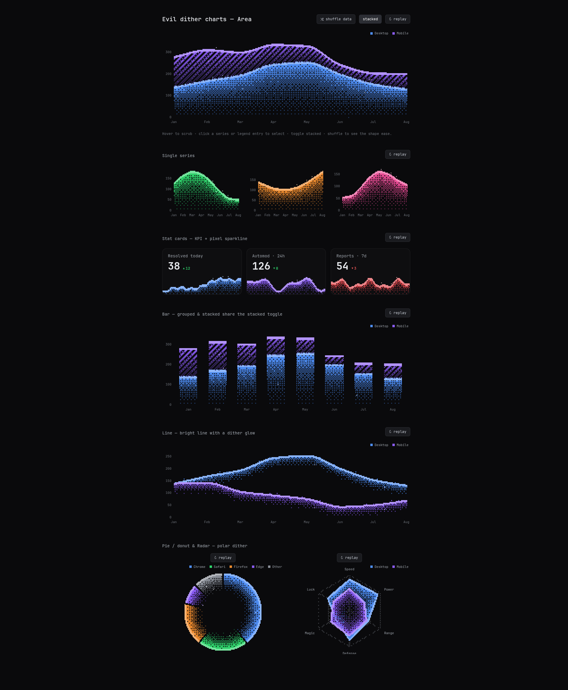

# dithermancer

> **Data doesn't have to be boring.** Dithered pixel-art charts for React / Next.js.

Dark, retro-styled charts rendered with *ordered dithering* (Bayer matrix), diagonal hatching, pixel glow, subtle sparkles, mono tooltips, and buttery intro + data-morph animations. 100% canvas rendering, **zero dependencies** (React is the only peer).



## Components

| Component | Style |
|---|---|
| `<AreaChart />` | Area with a bright pixel edge and dither fade; stacked or overlay |
| `<BarChart />` | Stacked or grouped bars with a bright cap per segment |
| `<LineChart />` | Bright solid line with a trailing dither glow |
| `<DonutChart />` | Donut/pie with polar dithering and slice gaps |
| `<RadarChart />` | Polygon over a dotted web, fill fading toward the center |
| `<Sparkline />` | Mini dithered area, no axes — for tables, headers, cards |
| `<StatCard />` | KPI tile: title, count-up number, ▲/▼ delta, sparkline footer |

## Installation

```bash
# straight from GitHub
npm i github:Iann29/dithermancer

# or locally (monorepo / testing)
npm i /path/to/dithermancer
```

Requires `react >= 18`. Works with any modern bundler (Next.js, Vite, etc.).

## Usage with Next.js (App Router)

The bundle ships with `"use client"` baked in — just import and use in any page or component:

```tsx
import { AreaChart } from 'dithermancer'

const data = [
  { label: 'Jan', desktop: 120, mobile: 80 },
  { label: 'Feb', desktop: 190, mobile: 95 },
  { label: 'Mar', desktop: 240, mobile: 110 },
  { label: 'Apr', desktop: 245, mobile: 91 },
]

export default function Page() {
  return (
    <AreaChart
      data={data}
      series={[
        { key: 'desktop', label: 'Desktop', color: '#4f8ff7' },
        { key: 'mobile', label: 'Mobile', color: '#8b5cf6', fill: 'hatch' },
      ]}
      stacked
      height={320}
    />
  )
}
```

Charts fill 100% of their container width (responsive via `ResizeObserver`); only the height is fixed by prop. The canvas background is transparent — it sits nicely on any dark background.

### Donut & Radar

```tsx
import { DonutChart, RadarChart } from 'dithermancer'

<DonutChart
  data={[
    { label: 'Chrome', value: 412, color: '#4f8ff7' },
    { label: 'Safari', value: 218, color: '#2fd66c' },
    { label: 'Firefox', value: 187, color: '#f08c2e' },
  ]}
  innerRadius={0.55} // 0 = pie
  height={300}
/>

<RadarChart
  data={[
    { label: 'Speed', a: 88, b: 62 },
    { label: 'Power', a: 92, b: 48 },
    { label: 'Range', a: 60, b: 55 },
    { label: 'Defense', a: 82, b: 70 },
    { label: 'Magic', a: 45, b: 60 },
  ]}
  series={[{ key: 'a', label: 'Hero' }, { key: 'b', label: 'Villain' }]}
  max={100}
  height={300}
/>
```

### Stat cards & sparklines

```tsx
import { StatCard, Sparkline } from 'dithermancer'

<StatCard
  title="Resolved today"
  value={38}
  delta={12}              // ▲ 12 (green)
  data={[3, 6, 5, 9, 14, 13, 18, 22, 27, 31, 38]}
  color="#4f8ff7"
/>

<StatCard
  title="Automod · 24h"
  value={126}
  delta={-8}
  deltaGood="down"        // a drop is good → ▼ 8 renders green
  data={hourly}
  color="#8b5cf6"
  curve="linear"          // jagged sparkline
/>

// standalone sparkline (tables, headers, anywhere)
<Sparkline data={[1, 4, 2, 8, 5, 9]} color="#2fd66c" height={48} />
```

The number **counts up** on mount and whenever `value` changes (`countUp={false}` disables it). The card border lights up on hover and the sparkline sits full-bleed at the bottom. `StatCard` also accepts a `ref` with `.replay()`.

### Replay (re-run the intro animation)

```tsx
import { useRef } from 'react'
import { AreaChart, type PixelChartHandle } from 'dithermancer'

const ref = useRef<PixelChartHandle>(null)
// ...
<AreaChart ref={ref} data={data} series={series} />
<button onClick={() => ref.current?.replay()}>replay</button>
```

When `data` (or `stacked`) changes, the chart **morphs** with a springy ease — no extra work needed.

## Common props

| Prop | Default | Description |
|---|---|---|
| `data` | — | Array of objects; numeric fields become series |
| `series` | — | `{ key, label?, color?, fill? }` — `fill: 'dither' \| 'hatch' \| 'solid'` |
| `xKey` | `'label'` | Field used for x-axis labels |
| `height` | `300` | Height in px (width follows the container) |
| `pixelSize` | `3` | Size of one chunky pixel in px |
| `stacked` | `false` | Stack series (Area/Bar); animates when toggled |
| `curve` | `'smooth'` | `'smooth'` (monotone cubic) or `'linear'` |
| `animate` | `true` | Intro animation + data morph |
| `sparkle` | `true` | Subtle twinkling bright pixels in the fills |
| `showLegend` / `showTooltip` / `showAxes` | `true` | Toggle each part |
| `formatValue` | compact | Formats tooltip/axis numbers |
| `theme` | dark | Partial `PixelTheme` override (fonts, axis/tooltip colors) |

Interactions: **hover** = crosshair + tooltip · **click** a series or legend entry = select (dims the others) · animations respect `prefers-reduced-motion`.

## Theme & palette

```tsx
import { darkTheme, PALETTE } from 'dithermancer'

<AreaChart
  theme={{ axis: '#555', text: '#aaa', font: '"JetBrains Mono", monospace' }}
  ...
/>
```

When a series has no `color`, the default palette kicks in: blue, purple, green, orange, pink, gray.

## Performance

- Renders on a low-resolution cell grid (e.g. 280×100 cells for an 840×300 chart) and upscales with `imageSmoothingEnabled = false` — per-frame cost is tiny and independent of DPR.
- Animations run through `requestAnimationFrame` outside React's render cycle (no per-frame re-renders).
- Sparkle twinkle pauses when the chart leaves the viewport (`IntersectionObserver`) or the tab is hidden.
- Pixel buffers and the offscreen canvas are reused across frames (no GC churn).

## Development

```bash
npm run build      # tsup → dist/ (ESM + CJS + .d.ts)
npm run typecheck
npm run demo       # bundles demo/main.tsx; serve demo/ with any static server
```

## Credits

Visual style inspired by [grim](https://x.com/grimcodes)'s "evil dither charts" concept.

## License

[The Unlicense](https://unlicense.org) — public domain. Take it, fork it, sell it, ship it. No attribution needed.
